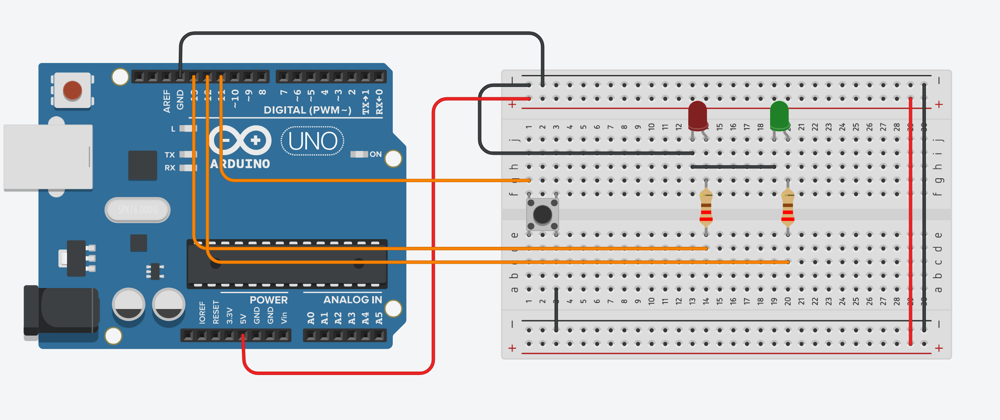

# Relazione tecnica - Diodi LED e resistori

## Obiettivo

Controllare due diodi LED con un solo pulsante. A ogni pressione il loro stato cambia e resta memorizzato fino alla pressione successiva.

## BOM (Bills of Material)

- Arduino Uno
- 2 diodi LED
- 2 resistori da 220 ohm
- 1 pulsante
- cavetti di collegamento

## Circuito

## Collegamenti

- LED 1: pin `D13` -> resistore -> anodo del LED; catodo a `GND`.
- LED 2: pin `D12` -> resistore -> anodo del LED; catodo a `GND`.
- Pulsante: un terminale al pin `D11` e l'altro a `GND`.
- Il pulsante usa `INPUT_PULLUP`, quindi a riposo viene letto come `HIGH` e premuto come `LOW`.

## Funzionamento

Il programma legge lo stato del pulsante e confronta il valore attuale con quello del ciclo precedente. La transizione da `HIGH` a `LOW` identifica una nuova pressione. In quel momento lo stato dei due LED viene invertito; tenendo premuto il pulsante non vengono generate altre commutazioni.

Sono presenti due soluzioni:

- la prima usa l'operatore XOR per invertire `ledState`;
- la seconda usa condizioni `if` esplicite per accendere o spegnere i LED.

Il ritardo di 50 ms riduce gli effetti del rimbalzo meccanico del pulsante.

**Autore:** Ignazio Leonardo Calogero Sperandeo

by jimbug // :)